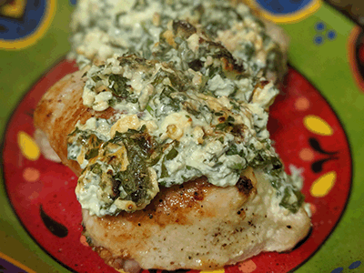

# Spinach Stuffed Chicken Breasts

## Ingredients
- 3 chicken breasts
- 8 oz chopped frozen spinach cooked according to package directions and squeezed dry.
- 3 oz feta crumbled ( about 1/2 cup )
- 4 oz cream cheese
- 1 clove garlic diced
- 1/4 teaspoon salt divided
- 1/8 teaspoon pepper
- 1 tablespoon olive oil

## Instructions
1. Preheat oven to 450 degrees fahrenheit.
1. Mix the chopped frozen spinach, feta, cream cheese, garlic and half of the salt in a medium sized bowl.
1. Cut a pocket into each chicken breast. If you are unsure of how to cut a pocket into the chicken without also cutting a pocket into your hand, try this: One at a time, place the chicken flat on a cutting board, and press a large spatula ( or something else that cannot be stabbed, i.e. DO NOT USE YOUR HAND) flat on top of the breast. Make sure that you are pressing the spatula down hard enough to hold the chicken in place. You may need to actually dig the edge of the spatula into the meat just a little bit to accomplish this. Insert the knife 2/3 of the way into the side of the thickest part of the chicken, and slice down to the thinnest part, stopping before you cut through; you want a pocket not a flap.
1. Separate the spinach and cheese mixture into three parts, and roll into thick logs. Stuff each log into the pocket you made in the chicken breasts. Season with remaining salt and pepper.
1. Heat the olive oil in an ovenproof pan set over medium high heat, then add the stuffed chicken, "top" side down. Cook for 5 minutes, then flip the chicken over.
1. Place the pan into the oven, and bake for 10 minutes. If your chicken breasts are extraordinarily thick, cook for 2 to 5 minutes longer, or until juices run clear when you poke the chicken with a fork.

---
[Home](../)