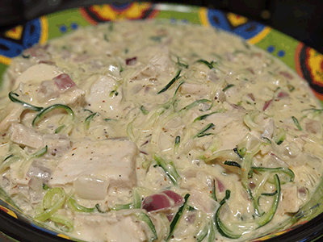

# Italian Chicken

## Ingredients
- 4 large Chicken breast
- 2 tbsp Sea salt
- 4 tsp Olive oil
- 4 tsp Italian seasoning
- 2 tsp Garlic powder
- Sea salt
- Black pepper

## Instructions
1. To brine the chicken breasts, place them in a large bowl with enough water to cover them. Add sea salt and stir to mostly dissolve. Let sit for 10 minutes at room temperature, or for up to a day in the refrigerator.
1. Preheat the oven to 450 degrees F (232 degrees C). Line and lightly grease a baking sheet.
1. Pat dry the chicken and place on the lined baking sheet. Brush with olive oil. Sprinkle with Italian seasoning (1/2 teaspoon (2 g) per side), garlic powder (1/4  teaspoon (1 g) per side), sea salt, and black pepper to taste. Repeat on the other side.
1. Bake for 15-18 minutes, until firm and no longer pink.

---
[Home](../)