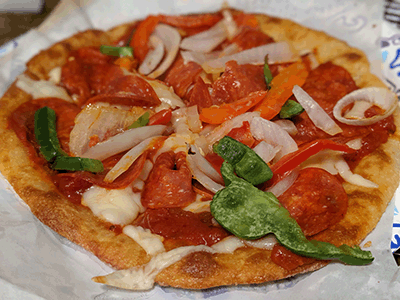

# Low Carb Pizza Crust

## Ingredients

-  3/4 cup [super fine almond flour](https://amzn.to/2HJIChQ)
-  2 cups mozzarella cheese finely shredded
-  2 tablespoons  cream cheese
-  1/4 to 1/2 teaspoon [sea salt](https://amzn.to/2HNt3RY) (1/4 is enough unless you really love salt)

## Instructions

1. Place rack in the center of the oven. Preheat oven to 425º Fahrenheit. Have two sheets of parchment about 15" long, a rolling pin and a pizza pan or baking sheet ready.
2. In a large saucepan, mix together the almond flour, mozzarella cheese, cream cheese and sea salt. Place mixture over low heat. Heat, stirring constantly, until cheese melts and the mixture becomes dough-like.
3. Place dough on one of the pieces of parchment. Shape into a disk. Cover with the other sheet of parchment.
4. Roll dough out into a 12" diameter circle.
5. Remove the top piece of parchment and slide the dough onto the pizza pan using the bottom piece of parchment.
6. Poke holes in the dough using a fork.
7. Place on center rack of the preheated oven. Bake for 6-8 minutes or until golden, watching carefully to prevent burning. Place pan on a cooling rack. Decrease oven temperature to 350º Fahrenheit. (You may need to open the oven door for a few minutes to allow excess heat to escape.)
8. Optional: to crisp up the crust a bit more, flip the crust over and bake for an additional 3-5 minutes.
9. Allow crust to cool 5-10 minutes. Place desired toppings on the crust. Bake an additional 5-8 minutes at 350º Fahrenheit, or until cheese has melted. Remove from oven and let cool about 5 minutes before cutting and serving.

------
[Home](../)

